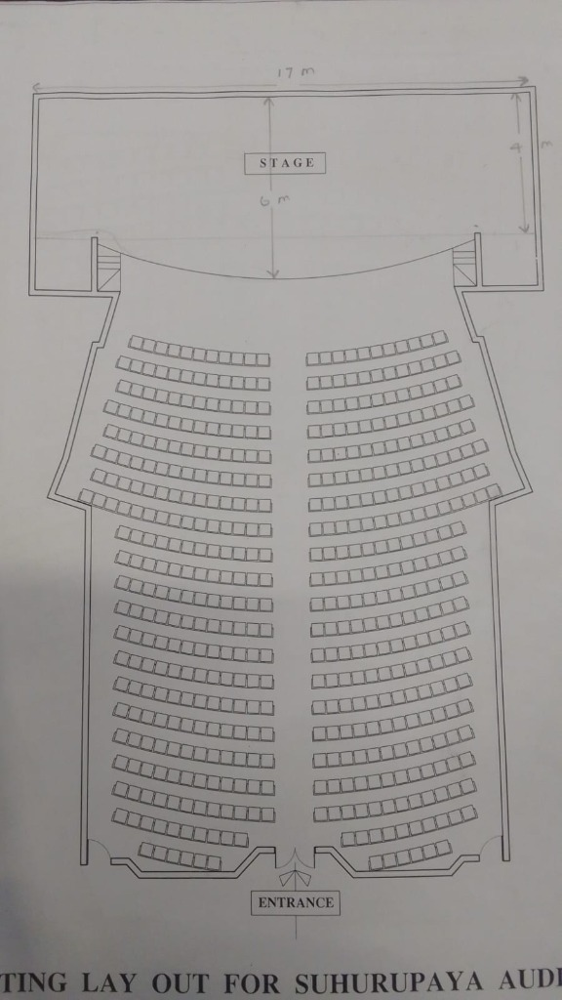

# Suhurupaya Auditorium - Concert Seat Booking, Admin Portal & Gate Scanner System

A comprehensive, full-stack, 100% free-of-charge concert seat reservation mobile and web application, administration management portal, and gate security QR scanner based on the official **Suhurupaya Auditorium** architectural seating blueprint.



---

## 🏛️ Venue Architecture & Seating Layout

- **Stage**: Top stage measuring **17m width by 4m-6m depth** with a curved apron.
- **Seating Sections**: Interactive vector map divided into two primary blocks (**Left Block** and **Right Block**) separated by a **central aisle** leading from the main **Entrance**.
- **Auditorium Capacity**: **438 seats** arranged in **30 concentric curved rows** (Rows A to DD):
  - **Upper Section (Rows A - K / 1 - 11)**: Flared auditorium walls with 6 to 10 seats per side.
  - **Lower Section (Rows L - BB / 12 - 28)**: 7 seats per side (14 seats per row).
  - **Rear Section (Rows CC - DD / 29 - 30)**: 6 and 5 seats per side near the entrance doors.
- **Seat Status Visuals**:
  - 🟢 **Green (Emerald)**: Available for public reservation.
  - 🟡 **Yellow (Amber)**: Selected by attendee (Strictly max 3 seats).
  - 🔴 **Red (Crimson)**: Booked by attendees.
  - 🔘 **Slate / Dark Gray**: Blocked / Reserved for VIPs by Admin.

---

## 🚀 Key Features

### 1. Public & Mobile Booking View (`/`)
- Interactive SVG auditorium map with pinch-to-zoom, pan, drag, and reset viewport controls.
- **Maximum 3 Seats Constraint**: Pop-up warning alert if an attendee attempts to pick a 4th seat.
- **100% Free of Charge**: No payment gateway required.
- **Guest Registration Modal**:
  - Full Name (සම්පූර්ණ නම)
  - National ID Number (NIC / Passport / ජා.හැ. අංකය)
  - Mobile Phone Number (දුරකථන අංකය)
  - Institution Arrival / Reference Number (ආයතනයේ පැමිණීමේ අංකය)
- **Instant Digital E-Ticket Pass**:
  - Downloadable PDF Ticket (`.pdf`) via jsPDF.
  - Browser print layout.
  - High-resolution QR code signed with HMAC-SHA256 cryptography to prevent forgery.

### 2. Admin Management Portal (`/admin`)
- **Master Interactive Seating Map**: Click any seat or select an entire row to toggle **VIP Blocked** status.
- Real-time updates broadcast instantly via **Socket.io** to all connected clients.
- **Real-Time KPI Dashboard**:
  - Total Capacity (438)
  - Available Seats
  - Reserved / Booked Seats
  - VIP Blocked Seats
  - Gate Checked-In Count
- **Attendee Registry Table**:
  - Search by Name, NIC, Mobile, Reference Number, or Seat ID.
  - Filter by Check-In status.
  - **Export to Excel (`.xlsx`)** via SheetJS.
  - **Export to PDF Report** via jsPDF AutoTable.
  - Cancel reservation & release seats control.
  - Test data reset control.

### 3. Gate Verification (QR Scanner Module) (`/scanner`)
- Designed for gate security staff and ushers on mobile devices (smartphones, tablets, laptops).
- **Live Camera Scanner** (HTML5 QR Code reader with camera toggle).
- **Manual Ticket Reference input** fallback.
- **Single-Use Anti-Fraud Logic**:
  - **Valid First-Time Scan**:
    - Vibrant green confirmation badge.
    - Displays Attendee Name, NIC, Institution Ref #, Assigned Seat Numbers, Seat Count.
    - Synthesizes a positive melodic chime (Web Audio API).
    - Marks ticket as `Checked-In` in database with timestamp.
  - **Duplicate Scan Attempt**:
    - Bright red flashing alert banner.
    - "DUPLICATE ENTRY DETECTED! Ticket was already checked in at [HH:MM:SS]".
    - Plays warning buzzer sound.
    - Prevents duplicate admission.
  - **Invalid / Tampered QR**:
    - Flags cryptographic signature mismatch or counterfeit pass.
- **Live Gate Activity Feed**:
  - Stream of recent check-ins with quick verification summary.

---

## 🛠️ Technology Stack

- **Frontend**: React 18, Vite, Tailwind CSS, Lucide Icons, Canvas Confetti, HTML5-QRCode, jsPDF, SheetJS (`xlsx`), Socket.io Client.
- **Backend**: Node.js 22, Express, Socket.io, `node:sqlite` (high-performance native WAL-mode SQLite), Web Crypto HMAC-SHA256.
- **Audio Synthesizer**: Native Web Audio API (zero external sound file dependencies).

---

## 🏃 Quick Start Guide

### 1. Run Production Server (Frontend + Backend on Port 5000)
```bash
cd backend
npm start
```
Open **[http://localhost:5000](http://localhost:5000)** in any browser.

### 2. Run Development Server (Hot Reload)
```bash
# Terminal 1: Backend
cd backend
npm run dev

# Terminal 2: Frontend (Vite)
cd frontend
npm run dev
```
Open **[http://localhost:3000](http://localhost:3000)**.

### 3. Run Automated System Verification Tests
```bash
cd backend
node test_system.js
```
